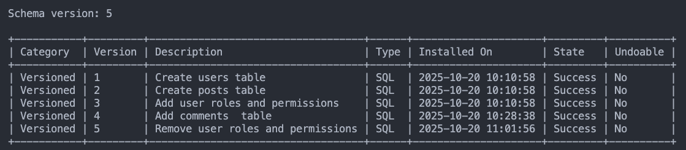
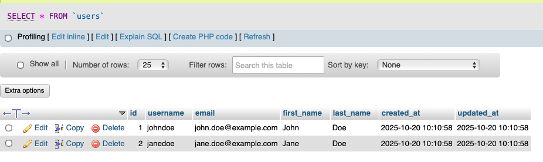

# Flyway Database Migration Experiment

This project demonstrates how to use Flyway for database migrations with MySQL, Docker, and phpMyAdmin.

## Project Structure

```
flyway1/
├── docker-compose.yaml    # Docker configuration for MySQL, Flyway, and phpMyAdmin
├── sql/                   # Flyway migration scripts
│   ├── V1__Create_users_table.sql
│   ├── V2__Create_posts_table.sql
│   ├── V3__Add_user_roles_and_permissions.sql
│   ├── V4__[Available for future migrations]
│   └── V5__Remove_user_roles_and_permissions.sql
└── README.md
```

## Services

- **MySQL 8.0**: Database server
- **Flyway**: Database migration tool
- **phpMyAdmin**: Web-based database management interface

## Getting Started

### 1. Start the Services

```bash
docker compose up
```

This will:

- Start MySQL database
- Start phpMyAdmin (accessible at http://localhost:8080)
- Run Flyway migrations automatically

### 2. Access phpMyAdmin

Open your browser and navigate to:

- URL: http://localhost:8080
- Username: `root`
- Password: `rootpassword`

### 3. View Migration History

In phpMyAdmin, check the `flyway_schema_history` table to see all applied migrations.

## Migration Files

Flyway migrations follow a naming convention: `V{version}__{description}.sql`

### V1: Create users table

- Creates the `users` table with basic fields
- Adds email index
- Inserts sample users

### V2: Create posts table

- Creates the `posts` table with foreign key to users
- Adds multiple indexes for performance
- Inserts sample posts

### V3: Add user roles and permissions

- Extends users table with role column
- Creates `roles`, `permissions`, and `role_permissions` tables
- Sets up a basic RBAC (Role-Based Access Control) system
- Assigns roles to existing users

### V4: Available for Future Migrations

- This is just another table for the experiments
- Use this slot to add new features or modifications as you wish

### V5: Remove user roles and permissions

- This step is to demonstrates rollback - or how to undo a previous migration
- Drops `role_permissions`, `permissions`, and `roles` tables
- Removes the `role` column from `users` table
- Note that we still have the comment table.
- Also note, this is a forward migration that undoes V3 - not a true "undo" command

## Flyway Commands

You can run Flyway commands manually:

### Run migrations

```bash
docker compose run --rm flyway migrate
```

### View migration info

```bash
docker compose run --rm flyway info
```

### Validate migrations

```bash
docker compose run --rm flyway validate
```

### Baseline (mark migrations as applied without running them)

```bash
docker compose run --rm flyway baseline
```

### Clean database (WARNING: removes all objects)

```bash
docker compose run --rm flyway clean
```

## Creating New Migrations

1. Create a new SQL file in the `sql/` directory
2. Follow the naming convention: `V{version}__{description}.sql`
   - Version must be sequential (V4, V5, etc.)
   - Use double underscore between version and description
   - Description should use underscores instead of spaces
3. Write your SQL statements
4. Run `docker compose up` or `docker compose run --rm flyway migrate`

### Example:

```sql
-- V4__Add_comments_table.sql
CREATE TABLE comments (
    id INT AUTO_INCREMENT PRIMARY KEY,
    post_id INT NOT NULL,
    user_id INT NOT NULL,
    content TEXT NOT NULL,
    created_at TIMESTAMP DEFAULT CURRENT_TIMESTAMP,
    FOREIGN KEY (post_id) REFERENCES posts(id) ON DELETE CASCADE,
    FOREIGN KEY (user_id) REFERENCES users(id) ON DELETE CASCADE
);
```

## Undoing Migrations

The free version of Flyway does unfortuately not provide an easy undo option, but it is not so hard to do this manually. however, when doing so, I think it is important to keep the change as part of the migration sequence instead of manually working on it directly in for example PhpMyAdmin.

So this is what the migration in V5 is supposed to illustrate.
This step will

- Drop the `role_permissions` junction table
- Drop the `permissions` table
- Drop the `roles` table
- Remove the `role` column from the users table

Add this file, peform the migration again with the command `docker compose run --rm flyway migrate`. Status will now be like this:

<center></center>

And you can verify that the `role` column has disappeared from the `users` table in phpmyadmin:

<center></center>

## Troubleshooting

### Migrations won't run

- Check Flyway logs: `docker compose logs flyway`
- Verify SQL syntax in migration files
- Ensure version numbers are sequential

### Database connection issues

- Wait for MySQL to be fully ready (healthcheck should help)
- Check database credentials in `docker-compose.yaml`

### Repair database

If we have had an error in the SQL - for example like I did when I incluused the PostgreSQL syntax "ALTER TABLE users DROP COLUMN IF EXISTS role;" on my MySQL database. That did not go down well...

After having done something like that, you will have to fix the schema manually before running migrations again. Use this command:

```bash
docker compose run --rm flyway repair
```

### Reset everything

```bash
docker compose down -v
docker compose up
```

or

```bash
docker compose run --rm flyway clean
```

## Best Practices

1. **Never modify applied migrations** - Create new migrations instead
2. **Version migrations sequentially** - V1, V2, V3, etc.
3. **Test migrations** - Always test on a copy of production data first
4. **Keep migrations small** - One logical change per migration
5. **Write reversible migrations** - Consider rollback scenarios
6. **Add comments** - Explain the purpose of each migration

## Learn More

- [Flyway Documentation](https://flywaydb.org/documentation/)
- [MySQL Documentation](https://dev.mysql.com/doc/)
- [Docker Compose Documentation](https://docs.docker.com/compose/)
